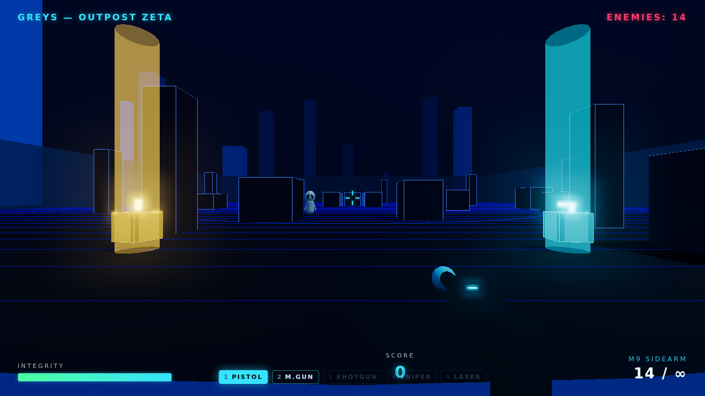
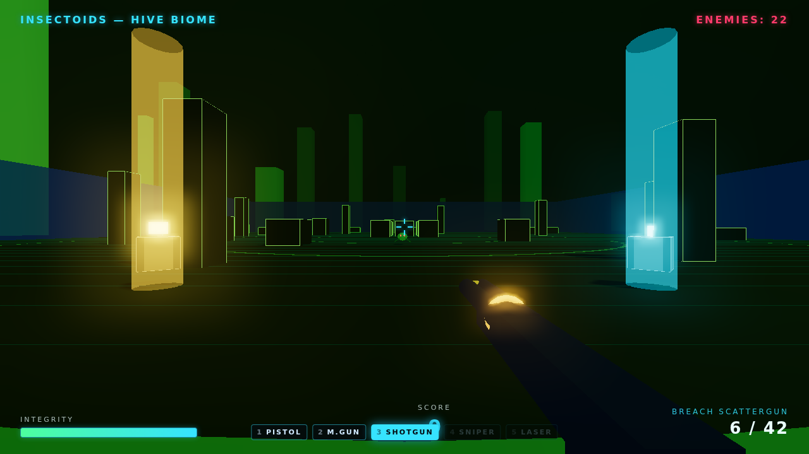
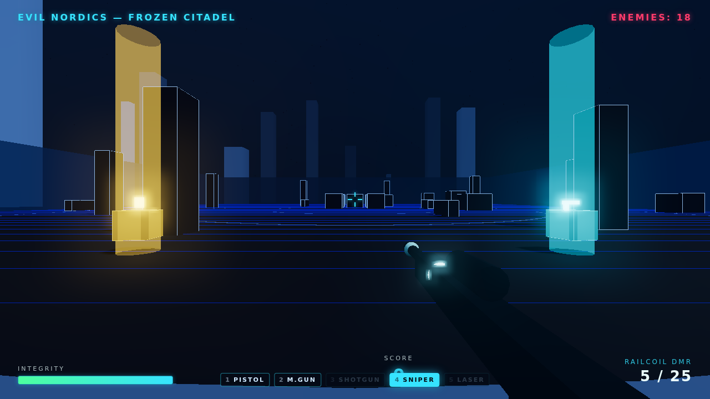
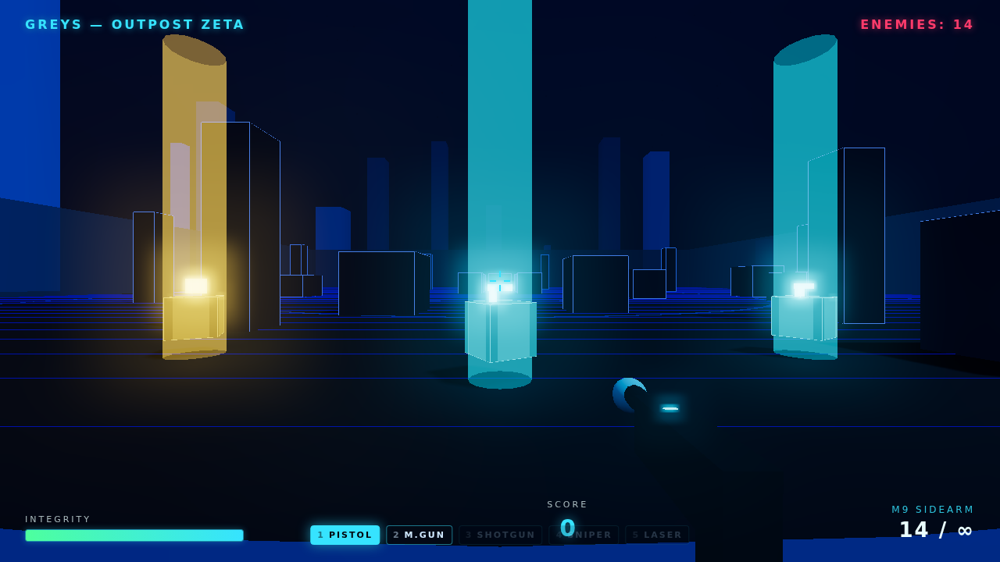
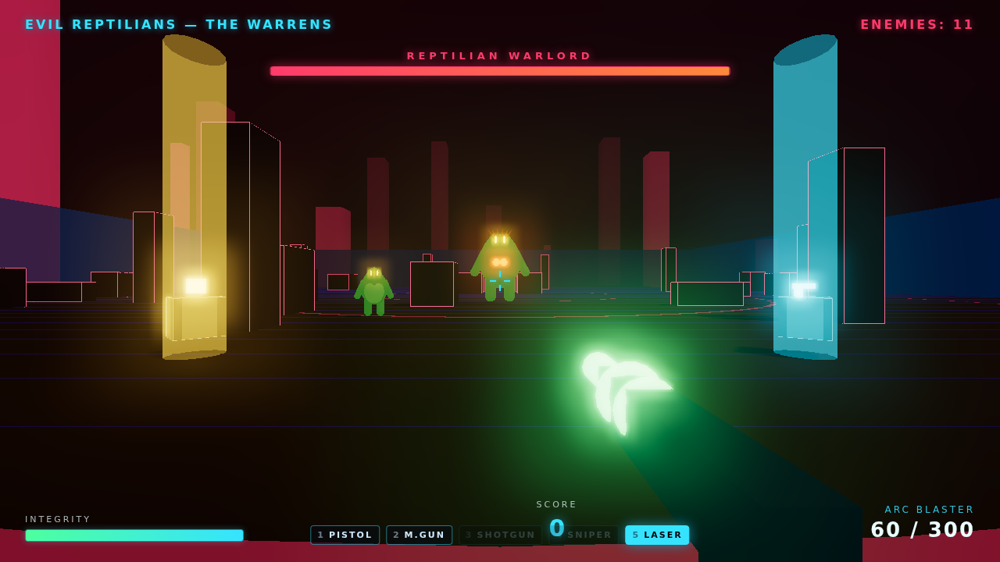

# Galactic Federation — Alien Shooter

A browser-based first-person shooter built with **Three.js** and **TypeScript**.
You are a trooper of the **Galactic Federation**, fighting through four planets,
each overrun by a different alien species:

1. **Greys** — Outpost Zeta (slow, fragile, swarm in numbers)
2. **Insectoids** — Hive Biome (fast and relentless)
3. **Evil Nordics** — Frozen Citadel (tall, armored, ranged plasma)
4. **Evil Reptilians** — The Warrens (slow, immense, brutal)

Clear every alien on a planet to advance. The final planet is guarded by the
towering **Reptilian Warlord** boss. Survive all four to win.



## Play it instantly (no install)

Open **[`game.html`](game.html)** directly in a browser — it's a fully
self-contained single-file build (all JavaScript and CSS inlined) that runs
straight from the filesystem, no server needed. Regenerate it any time with
`npm run build:single`.

## Gallery

| | |
|---|---|
|  |  |
| **Insectoids — Hive Biome** (Breach Scattergun) | **Evil Nordics — Frozen Citadel** (Railcoil DMR) |
|  |  |
| **Loot crates** — weapon / ammo / health | **Reptilian Warlord boss** (Arc Blaster) |

## Arsenal — 5 blasters

Switch with number keys `1`–`5` or cycle with `Q`. You start with the Pistol
and Machine Gun; the rest are unlocked from loot. Non-pistol weapons use finite
reserve ammo and auto-swap to the Pistol when fully dry.

| # | Weapon | Style |
|---|--------|-------|
| 1 | **M9 Sidearm** (pistol) | Semi-auto, reliable, infinite reserve |
| 2 | **Pulse Rifle** (machine gun) | Full-auto, fast, big magazine |
| 3 | **Breach Scattergun** (shotgun) | 9 pellets, devastating up close |
| 4 | **Railcoil DMR** (sniper) | One-shot power, heavy ADS zoom, tiny mag |
| 5 | **Arc Blaster** (laser) | Rapid green energy bolts, beam tracers |

## Loot boxes

Glowing crates with light beams drop from kills and are seeded into every level.
Walk over one to collect it:

- **Weapon** (cyan) — unlock a new blaster and equip it
- **Ammo** (yellow) — replenish reserves for all weapons
- **Health** (green) — repair integrity

## "Call of Duty meets space" feel

- **Sprint** (Shift), **aim down sights** (right click) with per-weapon FOV zoom + tighter spread
- Recoil kick, weapon bob, FOV punch and **camera shake** on fire / hits / explosions
- **Regenerating health** after staying out of fire, with a low-health pulse
- **Hitmarkers** (white on hit, red on kill) and a **kill feed**
- **Cover** crates, pillars and barriers block movement, shots and plasma bolts
- **Ranged Evil Nordics** that kite and fire plasma at you; mixed enemy types in later waves
- **Reptilian Warlord boss** with a 5-bolt plasma volley, heavy melee and a boss health bar
- Expansive arenas with per-level cover layouts, a distant skyline and a starfield
- Fully procedural **WebAudio sound effects** — shots, hits, explosions, boss roar (no audio files)

## Visual style

Sleek sci-fi neon: emissive procedurally-built aliens, dynamic lighting,
`UnrealBloom` post-processing, filmic tone mapping, fog, and a per-level neon
palette so each planet feels distinct. No external 3D art assets — every alien,
weapon and prop is composed from primitive geometry and glowing materials.

## Controls

| Action | Input |
| ------ | ----- |
| Move   | `W` `A` `S` `D` |
| Sprint | `Shift` (+ forward) |
| Look   | Mouse |
| Shoot  | Left click |
| Aim    | Right click (hold) |
| Reload | `R` |
| Switch weapon | `1`–`5`, or `Q` to cycle |
| Pause  | `Esc` |

Click the game to capture the mouse (pointer lock).

## Run locally

```bash
npm install
npm run dev          # http://localhost:5173
npm run build        # type-check + static bundle in dist/
npm run build:single # also writes the self-contained game.html
npm run preview      # serve the production build at http://localhost:4173
npm run test:e2e     # Playwright smoke test: loads, renders, no errors, boss spawns
```

## Project structure

```
src/
  Game.ts            game state machine, main loop, game-feel (shake/FOV), loot wiring
  constants.ts       tunables (player, camera, projectiles, arena)
  core/              Engine, PostProcessing (bloom), Input, Audio (WebAudio SFX)
  world/             Environment (lights, fog, sky, stars, skyline), Obstacles (cover), Loot
  player/            PlayerController (pointer lock, WASD, sprint, regen, heal), Health
  weapons/           WeaponTypes (5 defs), Weapon (active model/fire), Arsenal (inventory), Projectiles
  enemies/           Enemy base (chase/ranged/boss), EnemyFactory (4 aliens + boss), EnemyManager
  fx/                Particles (sparks, death explosions)
  levels/            per-level data (alien, palette, counts, boss flag, mix)
  ui/                HUD (health, ammo, weapon strip, boss bar, hitmarker, kill feed, toasts), Screens
scripts/inline.mjs   inlines the build into the single-file game.html
docs/screenshots/    images used in this README
```
